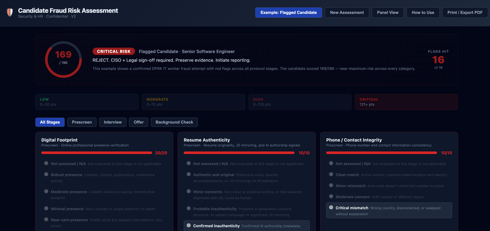

# Candidate Fraud Risk Assessment

A standalone, single-file HTML tool for assessing candidate fraud risk — designed to detect patterns consistent with DPRK IT worker fraud and similar hiring threats.

---



---

## Usage

Open `Candidate_Risk_Dashboard.html` in any browser. No server, no install, no build step required.

## Modes

- **Example mode** — displays a pre-filled CRITICAL-risk case based on a confirmed DPRK IT worker fraud scenario. Inputs are read-only.
- **Assess mode** — blank scorecard with editable candidate name/role fields, a Reset button, and a **Copy Review Link** button that encodes your full assessment as a URL-safe base64 string for sharing.
- **Panel View** — aggregate multiple reviewers' assessments into a composite score. Paste review links from each interviewer to combine them. Shows per-reviewer totals, per-category averages, and flags categories with MODERATE SPREAD or HIGH DISAGREEMENT across reviewers.

Switching between Example and Assess modes preserves each scorecard's state independently.

### Panel Review Workflow

1. Each interviewer completes their own assessment in Assess mode and clicks **Copy Review Link**.
2. A coordinator opens **Panel View** and pastes each reviewer's link.
3. The panel URL auto-updates in the browser address bar — bookmark or share it to preserve the full panel state.
4. Categories where reviewers disagree are flagged automatically. Categories marked "Not Assessed" by a reviewer are excluded from that reviewer's averages.

## Scoring

Sixteen categories span four hiring stages. Each category includes a **Not Assessed / N/A** option.

| Stage | Categories | Max Points |
|---|---|---|
| Prescreen | Digital Footprint, Resume Authenticity, Phone / Contact Integrity, Geographic Consistency, Timezone Behavior Patterns, Account / Identity Duplication, Third-Party Handler | 82 |
| Interview | Interview Signals, Technical Screen Signals, Reference Integrity | 41 |
| Offer | Compensation Behavior, Employer Verification | 23 |
| Background Check | Identity Documentation, Payment / Financial Flags, Hardware / Onboarding, Identity Continuity | 50 |

**Risk tiers** (0–196 total points):

| Score | Level | Action |
|---|---|---|
| 0–30 | LOW | Proceed normally. Standard monitoring. |
| 31–70 | MODERATE | Proceed with caution. Additional OSINT verification. Flag for CISO awareness. |
| 71–120 | HIGH | Do NOT extend offer without CISO approval. Full OSINT + live ID verification required. |
| 121+ | CRITICAL | REJECT. CISO + Legal sign-off required. Preserve evidence. Initiate reporting. |

## Development

```bash
npm install            # install dev dependencies (first time only)
pre-commit install     # activate pre-commit hook (first time only)

npm run lint           # run both linters
npm run lint:html      # HTMLHint only
npm run lint:js        # ESLint only (lints inline <script> via eslint-plugin-html)
```

The pre-commit hook runs both linters against staged `.html` files on every commit.

## Security

- No data is sent anywhere — entirely client-side, no network calls from application code.
- CSP restricts scripts to `cdnjs.cloudflare.com` (React 18 with SRI hashes) and inline scripts only.
- URL sharing uses `btoa`/`atob` builtins — no new CDN dependencies, no CSP changes required.
- Cache-control headers, `no-referrer`, `noindex`, and `Permissions-Policy` are intentional — do not remove them.

## License

MIT License — see [LICENSE](LICENSE). Copyright (c) 2026 Colorado = Security.
